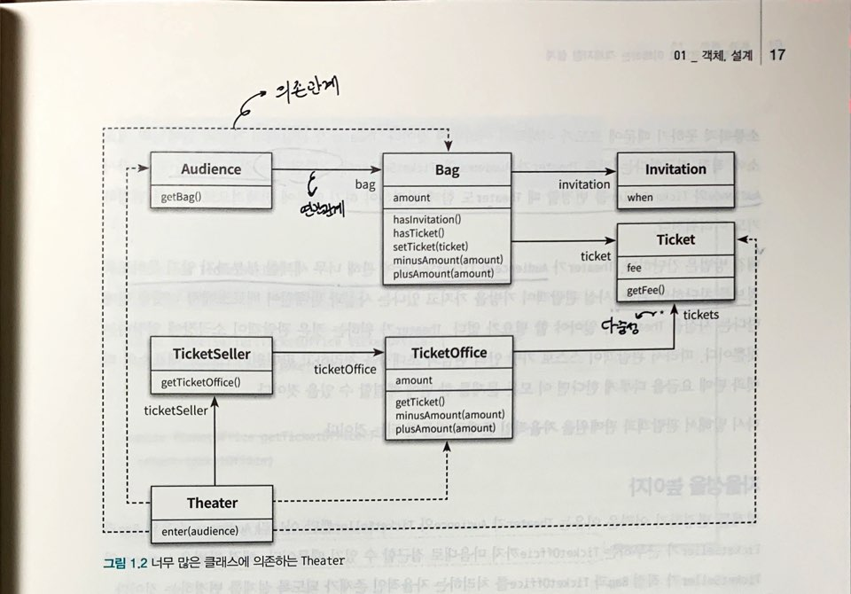
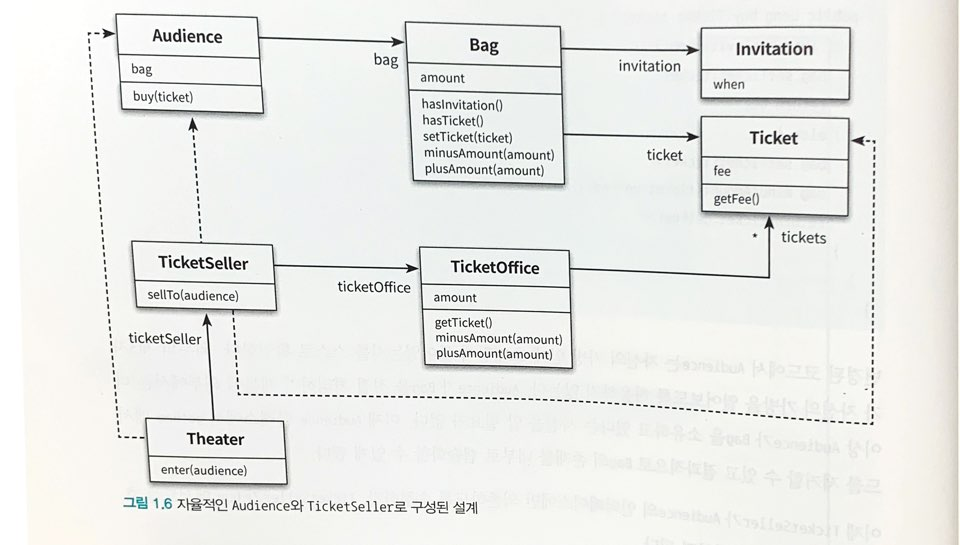
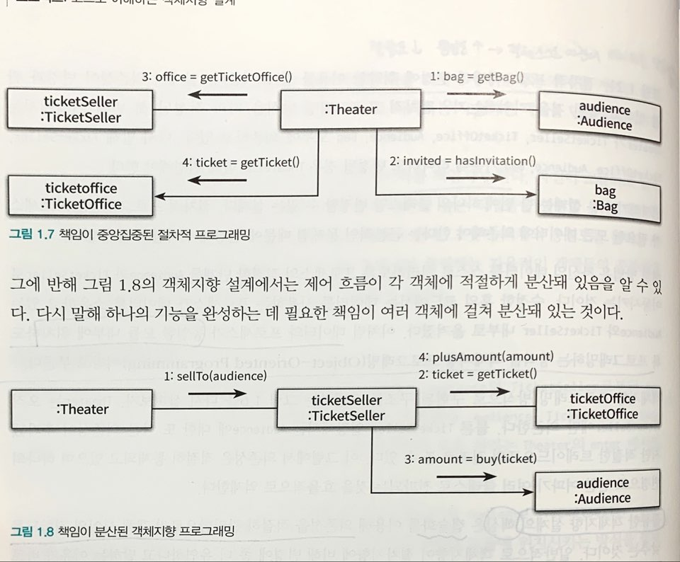
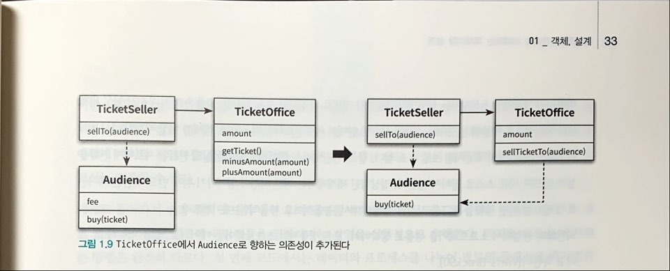

# Chapter 1 정리
로버트L 글래스(Rover L. Glass) : 이론이 먼저일까? 실무가 먼저일까?

- 해당 분야가 충분히 성숙해지는 시점에 이르러서야 이론이 실무를 추월하게 된다.

### Step 1. 절차적 프로그래밍
예시 로직) 

소극장(Theater)은 관람객(Audience)의 가방(Bag)을 열어 그 안에 초대장이 들어 있는지 살펴본다(hasInvitation).

(if 절)
가방 안에 초대장이 들어 있으면 판매원은 매표소에 보관돼 있는 티켈을 관람객의 가방 안으로 옮긴다.

(else 절)
가방 안에 초대장이 들어 있지 않다면 관람객의 갑아에서 티켄 금액만큼의 현금을 꺼내 매표소에 적립한 후에 매표소에 보관돼 있는 티켓을 관람객 의 가방 안으로 롬긴다.

### 로버트 마틴(Robert C. Martin) : 소프트웨어 모듈이 가져야 하는 세가지 

1.실행 중에도 제대로 동작

2.변경이 가능해야 한다.
- 간단한 작업만으로도 변경이 가능해야한다.
- 변경이 어려운 모듈은 제대로 동작하더라도 개선해야 한다.

3.코드를 읽는 사람과 의사소통하는 것이다.
- 읽는 사람과 의사소통 할 수 없는 모듈은 개선해야 한다.

### Step1 절차적 프로그래밍
1. 높은 의존성(변경에 취약)
- 다른 클래스가 해당 클래스 내부에 대해 더 많이 알면 알수록 해당 클래스를 변경하기 어려워진다.(=결합도, 의존성이 높다) 
- ex) Theater 클래스가 Audience, TicketSeller 클래스를 많이 알고 있어, 클래스 변경이 어렵다.

 

<사진 참조 17Page>

### Step2 설계 개선하기
* 의존성 낮추기(Theater 클래스가 Audience, TicketSeller 클래스에 관해 세세한 부분까지 알지 못하도록 정보를 차단한다.)
* TicketSeller 클래스에 sellTo 메서드를 추가, Audience 클래스에 buy 메서드 추가하여 세부적인 로직은 캡슐화 시킴.
* 즉 Theater 클래스가 Audience, TicketSeller 클래스에 관해 세세한 부분까지 알지 못하고 TicketSeller의 인터페이스에만 의존하도록 조치

 

<24 Page 사진>

### 무엇이 개선됐는가?
> AS-IS
>> Theater 클래스가 Audience, TicketSeller 클래스의 상세한 내부 구현까지 알고 있어야 했다.
>>
>>
>> ex) Theater > enter 메서드에서 ticketSeller.getTicketOffice, audience.getBag ..

> TO-BE
>> Theater 클래스가 Audience, TicketSeller 클래스 내부에 직접 접근하지 않는다.
>>
>> 인터페이스로 호출

      
### 절차지향 vs 객체지향
       
      Theater의 enter 메서드 : 프로세스
      Audience, TicketSeller, Bag, TicketOffice : 데이터라고 바라보면
      - 절차지향 : 프로세스와 데이터를 별도의 모듈에 위치시키는 방식
      - 객체지향 : 캡슐화를 통해 의존성을 적절히 관리하며, 각 객체(데이터)는 자신을 스스로 책임진다.
                  데이터와 프로세스를 하나의 단위로 통합해 놓는 방식(28p 편협한 시각이지만, 실용적인 조언)
                  

### Step3 더 개선할 수 있다.
    Bag 클래스는 Audience 클래스에 의해 끌려다니는 수동적인 존재이므로 개선!
    hold 메서드를 추가하여 Bag 클래스의 의존성을 낮췄다.
    but..TicketOffice로 향하는 의존성 추가되었다.

    

어떤 기능을 설계하는 방법은 한가지 이상일 수 있다.
동일한 기능을 한가지 이상의 방법으로 설계할 수 있기 때문에 설계는 트레이드오프 산물이다.

---
스터디 Check
1. 스터디 진행 방식(소스를 작성 or markDown문서만 작성 or 테스트코드까지 작성하여 돌려보기 etc..)