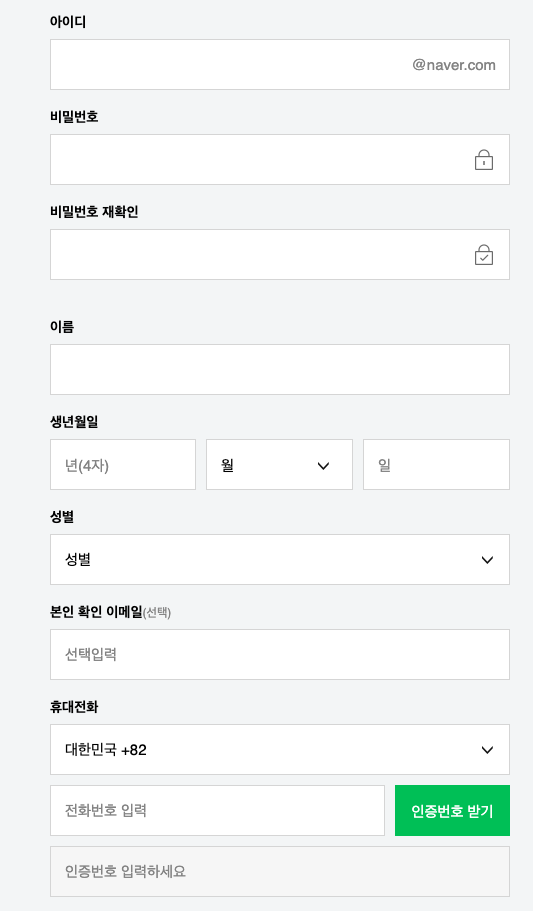

# 간단 회원 가입 OOP 구현
- 간단하게 네이버 회원 가입 화면을 기준으로 OOP로 구성해본다.

- TodoList
    - `회원 가입`
        - [ ] 회원 가입을 할 수 있다.
        - [ ] 제대로 된 정보를 입력하지 않았을 경우 예외를 내뱉는다.
    - `아이디`
        - [ ] 아이디를 입력할 수 있다.
        - [ ] 이미 사용중이거나 탈퇴한 아이디는 사용할 수 없다.
    - `패스워드`
        - [ ] 길이는 8 ~ 16자로 제한한다.
        - [ ] 영문, 대소문자, 숫자, 특수문자를 혼합해야한다.
        - [ ] 비밀번호 재확인시 동일해야 한다.
    - `이름`
        - [ ] 문자만 입력받을 수 있다.
    - `성별`
        - [ ] 남/녀를 선택할 수 있다.
    - `생년월일`
        - [ ] 숫자만 입력이 가능하다.
        - [ ] 년도는 총 4자이다.
        - [ ] 월은 최대 2자이다.
        - [ ] 일은 최대 2자이다.
    - `이메일`
        - 이메일 형식이 맞는지 체크한다.
    - `휴대전화`
        - 유효한 전화번호인지 체크한다.
        - 인증번호가 유효한지 체크한다.
